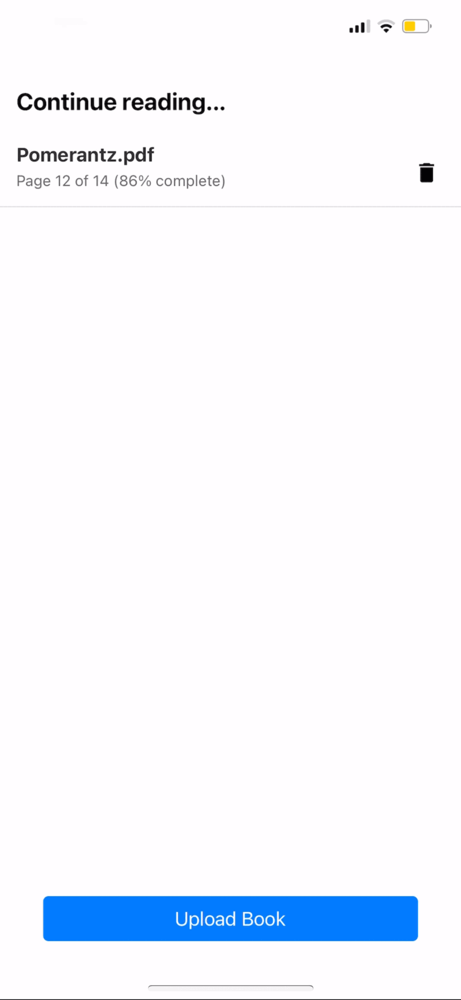

# Cervantes: "Turbo Reader"

We humans can read way faster than we think we can. We need to be pushed to achieve our potential.

In this side project, I developed a simple mobile app with React Native where you can submit any PDF, select how many words per minute you want to read, and the app will show you each word at a time, forcing you to keep up the pace. You can always pause with a single tap, resume with another tap, or double-tap on the left-hand side of the screen to go back, or on the right to skip forward.

The letter in the middle of each word is highlighted in red to help the brain recognize and autocomplete the word quickly. For future improvements, this approach could be refined by highlighting the vowel closest to the center of the word. For example, highlighting the "H" in "this" or the "C" in "wack" feels unnatural. More complex cases like "though" might benefit from selecting the left vowel, while longer or compound words like "throughout" present additional challenges. Starting with the closest central vowel is a promising initial strategy.

It can be particularly useful for quickly reading through documentation for new libraries.



## Running the project

### Setup

#### Backend

1. **Create and Activate Virtual Environment:**
   ```sh
   python -m venv env
   source env/bin/activate  # On Windows use `.\env\Scripts\activate`
   ```
2. **Activate the Virtual Environment:**
- On Windows:
```sh
.\env\Scripts\activate
```
- On macOS/Linux:
```sh
source env/bin/activate
```
3. **Install the Required Packages:**
```sh
pip install -r requirements.txt
```
4. **Run the Backend Server:**
```sh
fask run
```

#### Frontend
1. **Install Expo CLI:**
```sh
npm install -g expo-cli
```
2.**Navigate to the Frontend Directory:**
```sh
cd frontend/cervantes
```

3. **Install Dependencies:**
```sh
npm install
```


4. **Run the Expo App:**
```sh
expo start
```

## Features

- PDF Upload: Users can upload any PDF document.
- Text Extraction: The backend extracts text from the PDF and sends it to the frontend.
- Reading Visualization: The app displays each word separately at user-defined intervals.
- Control: Users can play, pause, resume, and navigate through the text with ease. They can tap on any word to start reading from that point or input a specific page number to jump directly to it.
- Zooming and Gestures: The app supports intuitive gestures including double-tap on the right or left side for navigation, single tap for play/pause, and pinch to zoom in and out for a customized reading experience.
- Local Storage: All data, including the user's progress, is saved to the smartphone's local storage. This ensures that users can resume reading from where they left off.

## Improvements
- State Management: Address inefficiencies in managing app state for smoother interactions.
- HTML Visualizer: Improve the PDF visualization approach, as the current HTML visualizer is not the most performant method.
- Client-Side Processing: Consider handling everything on the client-side, especially with simpler formats like EPUB.
- Best Practices: Follow coding standards for better readability and maintainability.
- TypeScript: Use TypeScript for type safety and reduced bugs.

**This project is a quick prototype for entertainment purposes and can be significantly enhanced.**

***

**Note:** This project was developed as a **quick side project** and is **not production-ready**. The focus was on functionality rather than code optimization and best practices.

